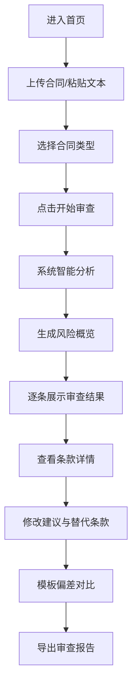

## 1. 产品概述

合同审查辅助系统是一款面向企业法务、商务人员及律师的智能合同风险识别工具。系统通过逐条扫描商业合同文本，自动识别不对等条款、模糊表述和缺失保障，对照常见合同模板标注偏差项，提示数据隐私、知识产权、竞业限制等合规风险，并给出具体的修改建议和替代条款表述。

- **核心价值**：提升合同审查效率，降低法律风险，为专业人士提供辅助参考
- **目标用户**：企业法务人员、商务谈判人员、执业律师、创业者
- **产品定位**：智能辅助审查工具，不替代专业律师的法律意见

## 2. 核心功能

### 2.1 用户角色

| 角色 | 注册方式 | 核心权限 |
|------|----------|----------|
| 普通用户 | 无需注册，直接使用 | 上传合同、查看审查结果、导出报告 |

### 2.2 功能模块

1. **首页/审查入口**：合同上传、文本输入、审查类型选择
2. **审查结果页**：风险概览、逐条分析、修改建议、替代条款
3. **条款模板库**：常见合同模板、标准条款参考、偏差对比

### 2.3 页面详情

| 页面名称 | 模块名称 | 功能描述 |
|---------|---------|---------|
| 首页 | 头部导航 | Logo、系统名称、免责声明入口 |
| 首页 | Hero区域 | 产品介绍、核心价值主张、立即审查按钮 |
| 首页 | 合同输入区 | 文件上传（支持PDF/Word/文本粘贴）、合同类型选择、开始审查按钮 |
| 首页 | 功能特性 | 六大核心能力展示卡片 |
| 审查结果页 | 风险概览仪表盘 | 风险等级分布、风险数量统计、合规评分 |
| 审查结果页 | 条款列表 | 逐条展示合同条款，标注风险类型和严重程度 |
| 审查结果页 | 风险详情面板 | 选中条款的详细分析、风险说明、修改建议、替代条款 |
| 审查结果页 | 模板对比 | 与标准合同模板的偏差对比展示 |
| 审查结果页 | 导出功能 | 导出审查报告（PDF/Word格式） |
| 条款模板库 | 模板列表 | 常见合同模板分类展示 |
| 条款模板库 | 模板详情 | 标准条款内容、风险点说明、最佳实践 |

## 3. 核心流程

用户进入首页后，可通过上传文件或粘贴文本的方式提交合同内容，选择合同类型后点击开始审查。系统进行智能分析，生成风险概览和逐条审查结果。用户可点击各条款查看详细风险分析和修改建议，对比标准模板偏差，最终可导出完整审查报告。

## 4. 用户界面设计

### 4.1 设计风格

- **主色调**：深海蓝（#0F2B5B），传达专业、可信赖的法律属性
- **辅助色**：赤金色（#C9A962），用于强调和高级感点缀
- **风险色**：深红（#C0392B）高风险、橙黄（#E67E22）中风险、青绿（#27AE60）低风险
- **中性色**：象牙白背景（#F8F6F1）、炭灰文字（#2C3E50）、浅灰边框（#D5D8DC）
- **按钮风格**：微立体按钮，圆角 6px，悬停时有微妙的阴影和色阶变化
- **字体**：标题使用 Noto Serif SC（衬线体，增强专业感），正文使用 Noto Sans SC（无衬线体，保证可读性）
- **布局风格**：左右分栏布局，左侧条款列表，右侧详情面板，卡片式设计
- **图标风格**：线性图标，与法律文书风格匹配，精致简洁

### 4.2 页面设计概述

| 页面名称 | 模块名称 | UI元素 |
|---------|---------|-------|
| 首页 | Hero区域 | 大标题衬线字体、副标题说明、CTA按钮、装饰性法律元素 |
| 首页 | 合同输入区 | 文件拖拽上传区、文本输入框、合同类型下拉选择、主操作按钮 |
| 首页 | 功能特性 | 六宫格卡片、图标+标题+描述、悬停微动效 |
| 审查结果页 | 风险概览 | 数据卡片、环形进度图、风险等级标签、评分展示 |
| 审查结果页 | 条款列表 | 可滚动列表、条款编号+摘要、风险标签、选中态高亮 |
| 审查结果页 | 详情面板 | 条款原文展示、风险分析、修改建议、替代条款、模板对比标签页 |
| 条款模板库 | 模板列表 | 分类标签、卡片网格、模板预览入口 |

### 4.3 响应式

- **设计策略**：桌面端优先，适配平板和移动端
- **桌面端**（1200px+）：左右双栏布局，左侧35%条款列表，右侧65%详情面板
- **平板端**（768-1199px）：保持双栏，调整比例为40%/60%
- **移动端**（<768px）：上下堆叠布局，条款列表可折叠，详情面板全屏展示
- **触摸优化**：按钮最小高度44px，列表项增加垂直间距，支持滑动操作

### 4.4 动效与交互

- **页面加载**：元素淡入上移动画，错落有致的延迟效果
- **审查过程**：进度条动画 + 扫描线效果，模拟智能分析过程
- **风险标签**：悬停时轻微放大，显示风险提示气泡
- **条款切换**：平滑过渡动画，内容淡入淡出
- **卡片悬停**：微妙的上浮效果 + 阴影增强
