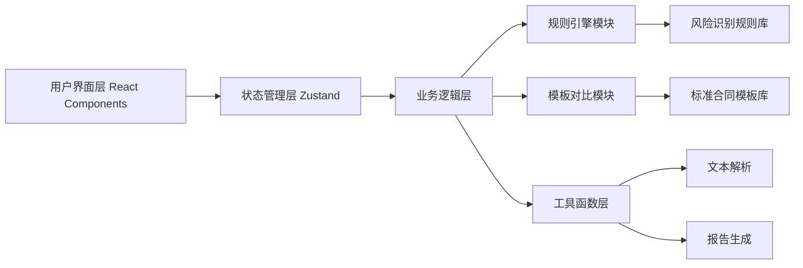

## 1. 架构设计

本系统为纯前端单页应用，采用 React + TypeScript 技术栈，所有合同审查逻辑在前端实现，使用内置的规则引擎和模板数据进行分析，无需后端服务。



## 2. 技术描述

- **前端框架**：React@18 + TypeScript
- **构建工具**：Vite@5
- **样式方案**：TailwindCSS@3
- **状态管理**：Zustand
- **路由管理**：React Router DOM@6
- **图标库**：Lucide React
- **后端**：无（纯前端应用）
- **数据**：Mock 数据 + 前端规则引擎

## 3. 路由定义

| 路由 | 页面 | 用途 |
|------|------|------|
| / | 首页 | 产品介绍、合同上传入口 |
| /review | 审查结果页 | 风险概览、逐条分析、修改建议 |
| /templates | 模板库 | 常见合同模板展示与参考 |

## 4. 核心数据结构

### 4.1 合同条款类型定义

```typescript
interface ContractClause {
  id: string;
  number: string;
  title: string;
  content: string;
  category: string;
  risks: RiskItem[];
  suggestions: SuggestionItem[];
  templateDeviation?: TemplateDeviation;
}
```

### 4.2 风险项类型定义

```typescript
interface RiskItem {
  id: string;
  type: 'inequality' | 'ambiguity' | 'missing' | 'compliance';
  severity: 'high' | 'medium' | 'low';
  title: string;
  description: string;
  relatedText: string;
}

type RiskType = 'inequality' | 'ambiguity' | 'missing' | 'compliance';
type RiskSeverity = 'high' | 'medium' | 'low';
```

### 4.3 修改建议类型定义

```typescript
interface SuggestionItem {
  id: string;
  type: 'modification' | 'addition' | 'deletion';
  originalText?: string;
  suggestedText: string;
  explanation: string;
}
```

### 4.4 审查结果类型定义

```typescript
interface ReviewResult {
  contractTitle: string;
  contractType: string;
  reviewDate: string;
  overallScore: number;
  riskSummary: {
    high: number;
    medium: number;
    low: number;
  };
  clauses: ContractClause[];
}
```

### 4.5 合同模板类型定义

```typescript
interface ContractTemplate {
  id: string;
  name: string;
  category: string;
  description: string;
  clauses: TemplateClause[];
}

interface TemplateClause {
  number: string;
  title: string;
  content: string;
  keyPoints: string[];
}
```

## 5. 模块结构

```
src/
├── components/          # 通用组件
│   ├── Header.tsx       # 页面头部
│   ├── Footer.tsx       # 页面底部
│   ├── RiskBadge.tsx    # 风险标签
│   └── ...
├── pages/               # 页面组件
│   ├── Home.tsx         # 首页
│   ├── Review.tsx       # 审查结果页
│   └── Templates.tsx    # 模板库页
├── store/               # 状态管理
│   └── contractStore.ts # 合同审查状态
├── data/                # Mock数据与规则
│   ├── mockContract.ts  # 示例合同数据
│   ├── templates.ts     # 标准合同模板
│   └── riskRules.ts     # 风险识别规则
├── utils/               # 工具函数
│   ├── textParser.ts    # 文本解析
│   ├── riskAnalyzer.ts  # 风险分析引擎
│   └── reportGenerator.ts # 报告生成
├── types/               # TypeScript类型定义
│   └── index.ts
├── App.tsx
├── main.tsx
└── index.css
```

## 6. 核心功能实现方案

### 6.1 风险识别规则引擎

基于关键词和模式匹配实现前端规则引擎：
- **不对等条款识别**：检测"乙方必须"/"甲方有权"等权利义务失衡表述
- **模糊表述识别**：检测"合理的"/"相关的"/"适当的"等模糊词汇
- **缺失保障识别**：检查必备条款是否存在（违约责任、争议解决、保密条款等）
- **合规风险识别**：检测数据隐私、知识产权、竞业限制相关条款的合规性

### 6.2 模板对比功能

将输入合同与标准模板进行结构对比，标注：
- 缺失的关键条款
- 表述差异较大的条款
- 额外增加的非常规条款

### 6.3 报告导出

前端生成可打印的审查报告，支持：
- 风险概览汇总
- 逐条风险详情
- 修改建议汇总
- 免责声明
